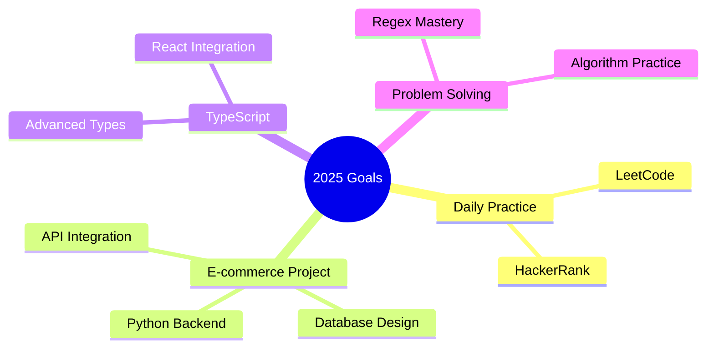

<h1 align="center">
  
</h1>

<p align="center">
  
</p>

<p align="center">
  
</p>

<div align="center">
  
  ```javascript
  const its_ak = {
    code: ["JavaScript", "Python", "HTML", "CSS"],
    askMeAbout: ["web dev", "tech", "app dev", "APIs"],
    technologies: {
        frontEnd: {
            js: ["React"],
            css: ["Tailwind CSS"]
        },
        backEnd: {
            js: ["Node", "Express"],
            python: ["Flask"]
        },
        databases: ["MongoDB", "PostgreSQL", "MySQL"],
        tools: ["Git", "GitHub", "VSCode", "Jupyter"]
    },
    currentFocus: "Building scalable web applications",
    funFact: "There are two ways to write error-free programs; only the third one works"
  };
  ```
  
</div>

## 🚀 About Me
<div style="display: flex; align-items: center; justify-content: space-between;">


- 🌱 Currently exploring **APIs** and **OOP** principles  
- 💻 Working on a **Flutter weather app**  
- 🎯 Making applications more realistic with APIs  
- ⚡ Always learning, always coding  
</div>

> *Transforming ideas into code, one commit at a time*

## 💻 Tech Stack

<div align="center">

### Frontend
[](https://skillicons.dev)

### Backend
[]

### Databases
[]

### Tools
[]

### Familiar With
[]

</div>
<!--
## 📊 This Week I Spent Time On
<div align="center">
  
</div> -->

## 🎯 Current Goals


## 🤝 Connect with Me
<div align="center">
  
[](https://alokkumar777.github.io/my-portfolio/)
[](https://www.linkedin.com/in/alok-kumar-8b47a4270)
[](https://x.com/Alokumar1810)

</div>

<div align="center">
  
</div>

---

<div align="center">
  
</div>

<h4 align="center">
  Thanks for visiting! Feel free to get in touch with me. I am always open to discussing new projects, creative ideas or opportunities to be part of your visions. 🚀
  
</h4>
